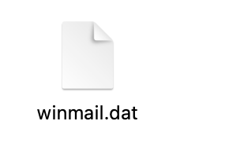
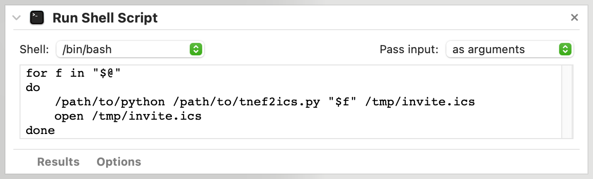
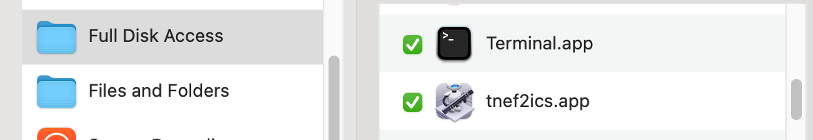

# TNEF to ICS calendar invites in winmail.dat extractor

This Python script parses calendar invite information included in winmail.dat files sent by some Exchange email servers and 
generates a calendar invite in ICS format. 

## The Problem

Have you ever received an email with a mysterious attachment named _winmail.dat?_ If that's the case, it's highly likely that the sender of that message
is using Microsoft Outlook and/or a Microsoft Exchange email server and that you are using a different email client (such as Apple Mail) on a computer 
that isn't running the Windows operating system (such as macOS).



Such _winmail.dat_ files use a proprietary Microsoft format called 
[Transport Neutral Encapsulation Format (TNEF)](https://en.wikipedia.org/wiki/Transport_Neutral_Encapsulation_Format)
and can include rich-text formatted email, attached files or calendar invites.
[Several tools](https://en.wikipedia.org/wiki/Transport_Neutral_Encapsulation_Format#Decoding)
are available to extract data from _winmail.dat_ files, such as Josh Jacob's 
[TNEF's Enough](http://www.joshjacob.com/mac-development/tnef.php) on macOS.
However, while TNEF's Enough is able to extract the body of the offending email and any attached files, it is currently not able to extract calendar
invitations that are encoded directly within the TNEF payload (as opposed to an attached ICS calendar invite). The Gmail web client usually does a good
job extracting this information and can be sometimes used to open calendar invites hidden in _winmail.dat_ files, but can sometimes miss critical information
such as accurate meeting date and time.

Fortunately this looks like a relatively rare problem. I work with a variety of clients, several are using Microsoft Exchange and I have no problem
opening their emails and calendar invitations on Apple Mail on my macOS machine. I do however have one client for which I consistently am unable to open
their calendar invites. They show up as _winmail.dat_ in their emails, and even after opening them in the Gmail client or through TNEF's Enough, I'm not
able to add their invites to my calendar and respond to them, which is annoying to say the least.

## The Solution

To resolve this situation, I wrote a short Python script that takes advantage of the [tnefparse](https://github.com/koodaamo/tnefparse)
and [icalendar](https://icalendar.readthedocs.io/en/latest/) libraries to extract the relevant information
from TNEF-encoded _winmail.dat_ attachments and convert it into an ICS invitation file, which I can then open normally in my calendar app.

This is a quick and dirty solution that works for me for that particular client, but hasn't been tested on other _winmail.dat_ files. Also ideally
this functionality could be included in the tnefparse library and its command-line utility, but I haven't yet figured out how to do it. Once I do,
I intend to submit a pull request to tnefparse.

### Dependencies

As stated above, this script relies on two Python libraries:
- [tnefparse](https://github.com/koodaamo/tnefparse)
- [icalendar](https://icalendar.readthedocs.io/en/latest/)

These consequently need to be installed on your machine if you want to be able to run this script. This can be done for example by using `pip`:

```
pip install tnefparse
pip install icalendar
```

### How to use

The script expects at least one argument, which is a path to the input _winmail.dat_ file:

```
python tnef2ics.py input/winmail.dat
```

The second argument is optional, it is the path where the resulting ICS file should be written. If this is omitted, the script will
write to a file called _invite.ics_ in the current directory.

```
python tnef2ics.py input/winmail.dat output/invite.ics
```

On macOS, it is also possible to use Automator to create a small app which can be used to run this script by using the "Open with"
contextual menu on _winmail.dat_ files, or by drag and dropping such files onto it.

To do this, create a new workflow in Automator and choose to save it as an Application. Find the Run Shell Script action, select 
"Pass input as arguments" and write the following as the code to be run:

```
for f in "$@"
do
    /path/to/python /path/to/tnef2ics.py "$f" /tmp/invite.ics
    if [ $? -eq 0 ]; then
    	open /tmp/invite.ics
    fi
done
```

The if statement checks if the script exited without error before attempting to open the ICS file. Otherwise you risk opening an
older ICS file without realizing.



Be sure to replace the placeholder text with your actual paths to the Python binary and the tnef2ics.py script.

Save the application thus created. You will probably need to grant Full Disk Access to it in order to work. Do so at your own risk:




## Changelog

* 2022-06-08 - Fixed timezone issue
* 2022-06-07 - Added instructions to run it as an Automator app
* 2022-06-07 - First version of the script. It successfully parses simple calendar invitations. All other information is ignored.
